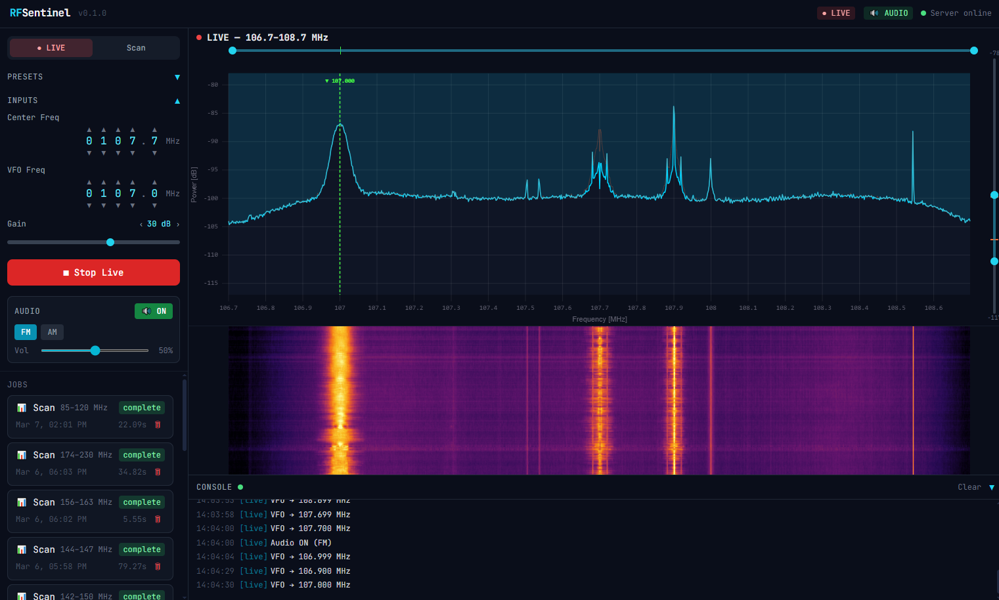

# RFSentinel

**Open-source RF spectrum monitoring platform**

RTL-SDR based tool for real-time RF spectrum analysis with live audio demodulation.




## Quick Start

```bash
# Install Python dependencies
pip install -r requirements.txt

# Start the backend (SDR required)
python -m core.api.server

# In a second terminal, start the frontend
cd frontend
npm install
npm run dev

# Open http://localhost:5173
```

## Requirements

- **Hardware:** RTL-SDR Blog V4 (or compatible)
- **OS:** Windows 10/11, Linux
- **Python:** 3.10+
- **Node.js:** 18+ (for frontend)

## Features

### Live Mode

Continuous real-time spectrum display:

- Live-updating power spectrum with scrolling waterfall spectrogram
- Max-hold trace (decaying peak envelope)
- Temporal PSD smoothing (EMA) for stable display and better weak-signal visibility
- Click-to-tune VFO marker with draggable repositioning
- FM/AM audio demodulation streamed as PCM over WebSocket
- Drag-to-pan and scroll-to-zoom on the frequency axis
- Dual-thumb range sliders for both axes

### Scan Mode

Captures a spectrum + waterfall over a frequency range, stitching multiple chunks for wide sweeps (>1.6 MHz bandwidth per chunk, 80% usable with edge trimming). Full-resolution 1D spectrum with decimated 2D waterfall for web delivery. Scan history persisted in SQLite — browse, re-view, or delete past scans. Running scans can be cancelled.

### Frontend

- uPlot-based spectrum chart with real-time updates
- Waterfall spectrogram with contrast slider
- Preset buttons for common bands (FM, airband, ham, ISM)
- Scan history panel — browse past scans, view results, delete entries
- Real-time log console and job history via WebSocket

## License

MIT
